# Scanneur de vulnérabilités SSL/TLS

## Description
Ce projet est un scanneur de vulnérabilités SSL/TLS développé en Python. Il permet d'analyser la configuration SSL/TLS d'un serveur cible, de détecter les vulnérabilités potentielles et de générer un rapport détaillé. De plus, il intègre une fonctionnalité de scan de ports ouverts en utilisant Nmap.

## Architecture du projet

```
SSL-TLS
│   .env
│   .gitignore
│   docker-compose.yml
│   Dockerfile
│   Readme.md
│   requirements.txt
│   ssl_tls_scanner.py
│   tree.txt
│   vulnerability_scanner.py
│
├───.github
│   └───workflows
│           ci.yml
│
├───Diagrammes
│       Diagramme_Architecture.png
│       Diagramme_sequence.png
│       Workflow_Diagram.png
│
├───images
│       compose-build.png
│       compose-up.png
│       console.png
│       Diagramme_sequence.png
│       docker-image.png
│       docker_login.png
│       image.png
│       image1.png
│       scan1.png
│       scan2.png
│       up.png
│       Workflow_Diagram.png
│
├───tests
│   │   test_ssl_tls_scanner.py
│   │   test_vulnerability_scanner.py
│   │   __init__.py
│   │
│   └───__pycache__
│           test_ssl_tls_scanner.cpython-310-pytest-8.3.2.pyc
│           test_ssl_tls_scanner.cpython-310.pyc
│           test_vulnerability_scanner.cpython-310-pytest-8.3.2.pyc
│           __init__.cpython-310.pyc
│
└───__pycache__
        ssl_tls_scanner.cpython-310.pyc
        vulnerability_scanner.cpython-310.pyc
```
        

## Fonctionnalités
- Analyse de la configuration SSL/TLS d'un serveur
- Détection de protocoles obsolètes et de suites de chiffrement faibles
- Génération de rapports détaillés
- Scan des ports ouverts sur le serveur cible
- Recommandations pour améliorer la sécurité

## Considérations Légales⚖️
✅ Respect de la Législation en Cybersécurité 
📝 Autorisation et Consentement
🔒 Protection des Données
## Considérations Éthiques💡
🌱 Renforcement de la Sécurité 
💼 Utilisation Responsable
🤝 Partage des Bonnes Pratiques

## Worflow
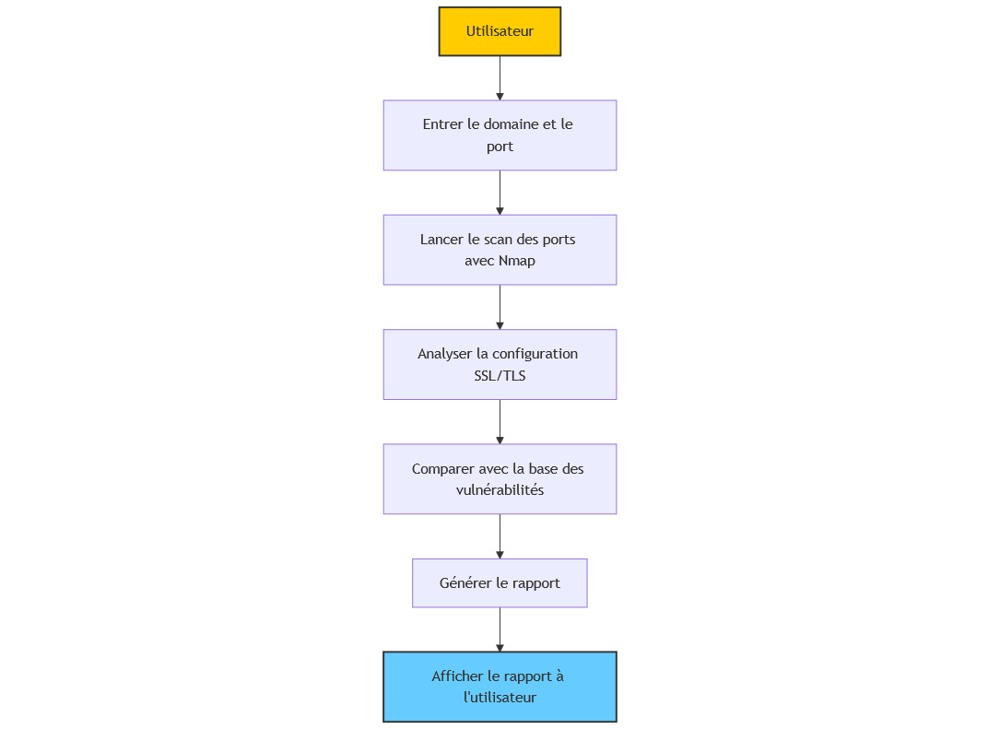

## Diagramme de séquence
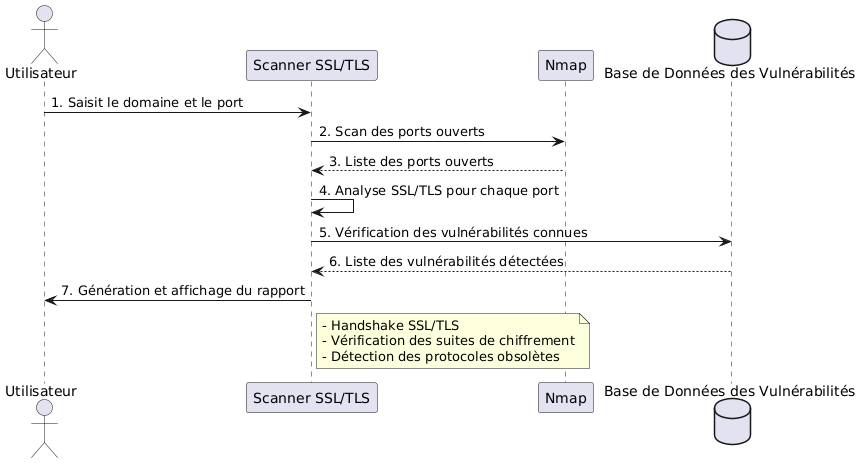

Acteurs principaux :

   -Utilisateur : Lance le scan et reçoit le rapport.
   -Scanner SSL/TLS : Exécute l'analyse et détecte les vulnérabilités.
   -Nmap : Scanne les ports ouverts.
   -Base de Données des Vulnérabilités : Fournit la liste des vulnérabilités connues.

## Diagramme d'architecture
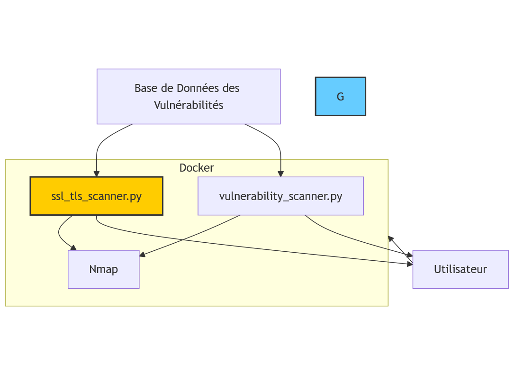

## Prérequis
- Python 3.6+
- pip (gestionnaire de paquets Python)
- Nmap
- Docker (pour la conteneurisation)

## Installation de Nmap (Windows)
1. Téléchargez l'installateur Nmap pour Windows depuis le site officiel : https://nmap.org/download.html#windows
2. Exécutez l'installateur en tant qu'administrateur.
3. Suivez les instructions d'installation, en acceptant les options par défaut.
4. Une fois l'installation terminée, redémarrez votre invite de commande ou PowerShell.
5. Vérifiez l'installation en tapant `nmap --version` dans l'invite de commande

## Installation
1. Clonez ce dépôt :
   ```
   git clone https://github.com/ANANA1218/SSL-TLS.git
   cd SSL-TLS
   ```

2. Installez les dépendances requises :
   ```
   pip install -r requirements.txt
   ```

## Utilisation de ssl-tls-scanneur
1. Assurez-vous que Nmap est correctement installé et accessible depuis la ligne de commande.
2. Exécutez le script principal :
   ```
   python ssl_tls_scanneur.py
   ```

3. Suivez les instructions à l'écran pour entrer le nom de domaine et le port à scanneur.

Exemple 1 :
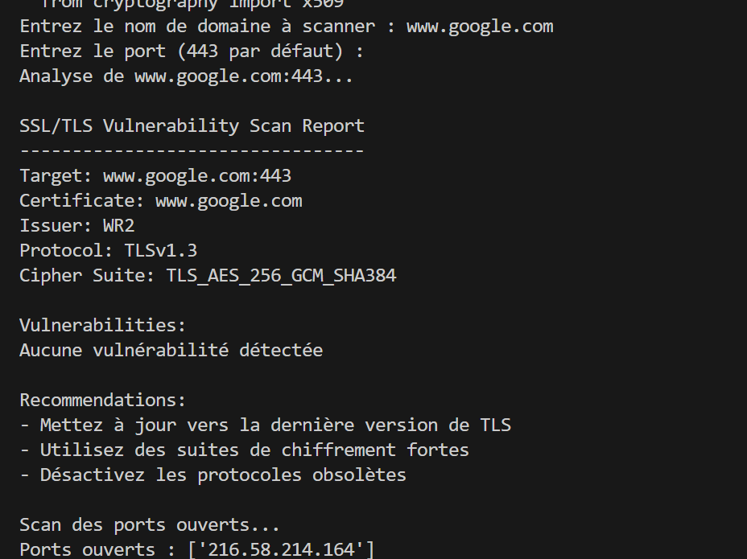

Exemple 2 :

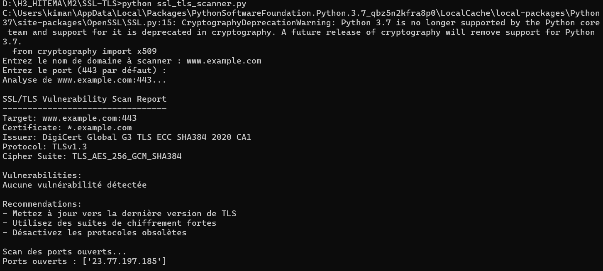

4. Le script effectuera l'analyse et affichera les résultats dans la console.

## Utilisation de vulnerability_scanneur
1. Assurez-vous que Nmap est correctement installé et accessible depuis la ligne de commande.
2. Exécutez le script principal :
   ```
   python vulnerability_scanneur.py
   ```

3. Suivez les instructions à l'écran pour entrer le nom de domaine et le port à scanneur.

Exemple 1 :

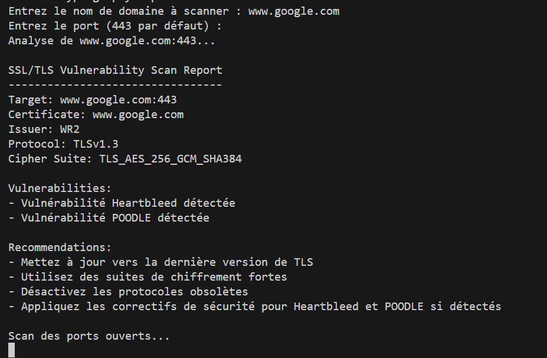

Exemple 2 :

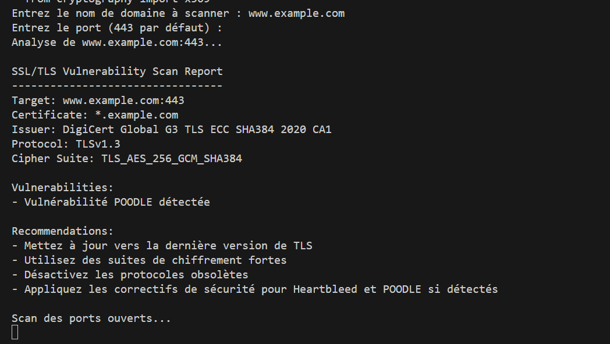

4. Le script effectuera l'analyse et affichera les résultats dans la console.

## Conteneurisation avec Docker

### Prérequis
- Docker installé sur votre système

### Fichiers de configuration Docker
Vous aurez besoin de deux fichiers :
- `Dockerfile` : Définit l'environnement et les instructions pour construire l'image Docker.
- `docker-compose.yml` : Définit les services, les volumes et la configuration réseau pour l'application.

Consultez les exemples de `Dockerfile` et `docker-compose.yml` dans le dépôt.

### Construction et exécution du conteneur
1. Construisez l'image Docker :
   ```
   docker-compose build
   ```
Resultat au lancement de la commande :

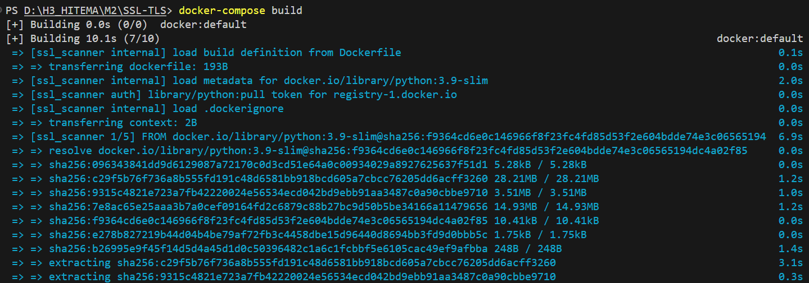

Resultat dans le docker desktop:

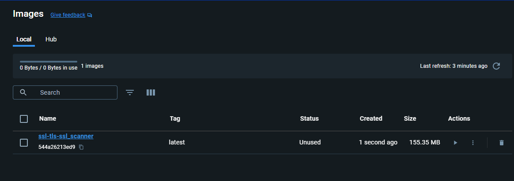

2. Exécutez le conteneur :
   ```
   docker-compose up
   ```

Resultat au lancement de la commande :

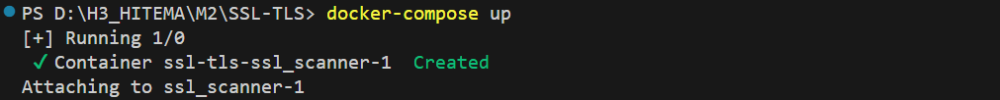

Resultat dans le docker desktop:

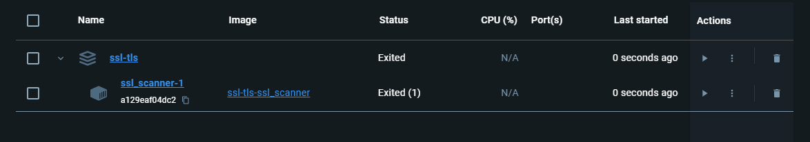

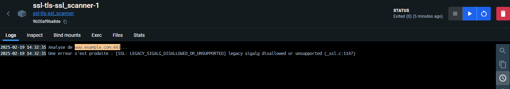

Ces commandes vont construire et lancer le conteneur Docker avec votre scanneur SSL/TLS.

## Publication sur Docker Hub

1. **Créez un compte Docker Hub** : Si vous n'en avez pas déjà un, créez un compte sur [Docker Hub](https://hub.docker.com/).

2. **Connectez-vous à Docker Hub** depuis votre terminal :

   ```
   docker login
   ```

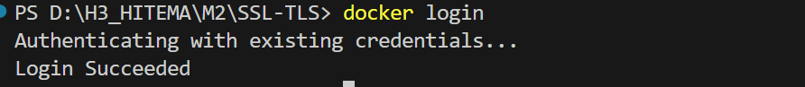


3. **Taguez votre image** avec votre nom d'utilisateur Docker Hub :

   ```
   docker tag votre-image:tag votre-username/votre-repo:tag
   ```

Remplacez `<image-id>` par l'ID de votre image Docker, `<votre-nom-d'utilisateur>` par votre nom d'utilisateur Docker Hub, `<nom-du-repo>` par le nom de votre repository, et `<tag>` par le tag de votre image (par exemple, `latest`).

4. **Poussez l'image** taguée vers Docker Hub :

   ```
   docker push votre-username/votre-repo:tag
   ```

5. **Vérifiez la publication** : Sur le site Docker Hub, vérifiez que votre image a bien été publiée dans votre repository.

## Test Unitaire 

Cette section décrit la procédure de test unitaire pour le projet de scanner de vulnérabilités SSL/TLS. Les tests couvrent les fonctionnalités principales des fichiers `ssl_tls_scanner.py` et `vulnerability_scanner.py` en utilisant le module `unittest` de Python.

1. Structure des Tests
- **tests/test_ssl_tls_scanner.py** :
  - Vérifie l'analyse SSL/TLS, la détection de vulnérabilités et la génération de rapports.
  - Simule des connexions SSL et des résultats Nmap.

- **tests/test_vulnerability_scanner.py** :
  - Vérifie la détection des vulnérabilités Heartbleed et POODLE.
  - Teste le scan des ports et la génération de rapports.

2. Exécution des Tests
Pour exécuter tous les tests, utilisez la commande suivante à la racine du projet :
```bash
pytest tests/
```

Pour exécuter un fichier de test spécifique :
```bash
python -m unittest tests/test_ssl_tls_scanner.py
python -m unittest tests/test_vulnerability_scanner.py
```

3. Rapports de Tests
Pour générer un rapport de test détaillé avec pytest, utilisez :
```bash
pytest tests/ --tb=long --maxfail=3 -v
```

## GitHub Action

### Structure du Workflow
Le workflow GitHub Actions permet d'exécuter automatiquement les tests unitaires à chaque push ou pull request sur la branche `main` ou `master`.

### Chemin du Fichier
`.github/workflows/ci.yml`

### Contenu du Workflow
- **Nom du workflow :** `CI - Tests Unitaires SSL/TLS Scanner`
- **Plateforme :** Ubuntu-latest
- **Versions Python :** 3.8, 3.9, 3.10
- **Outils :** pytest pour les tests unitaires

### Étapes du Workflow
1. **Checkout du code** : Récupère le code source du dépôt GitHub.
2. **Installation de Python** : Configure la version spécifiée de Python.
3. **Installation des dépendances** : Installe les dépendances listées dans `requirements.txt`.
4. **Exécution des tests** : Lance `pytest` avec des options de rapport détaillé.

### Lancer le Workflow Manuellement
Vous pouvez également déclencher le workflow manuellement depuis l'onglet **Actions** de GitHub.

## Ajout du Badge GitHub Actions
```markdown


```


